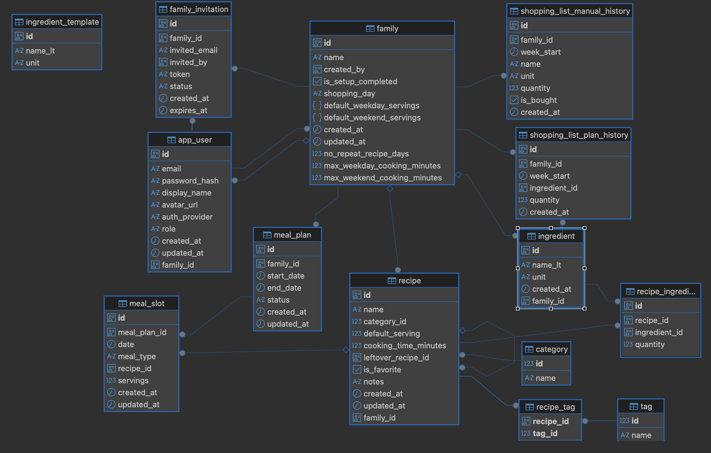

# Family Food Shopping Planner

A collaborative weekly meal planner for families.

**Live:** [https://forkplan.app](https://forkplan.app)

**Try it:** `forkplan@test.com` / `Password`

## The problem

Planning weekly meals and writing shopping lists is repetitive, time-consuming work. Half the family doesn't know what's for dinner — half the shopping list gets forgotten at the store. I wanted **one button** to plan a week of meals, and the shopping list to follow automatically. The whole family edits the same plan and shops from the same live list. The key point is to plan meals you already know how to cook — so the cooking itself isn't the obstacle.

## Why this one and not the others?

There are plenty of meal planners and shopping-list apps out there. Most pick one or the other, and almost all of them lock you into their own catalog of recipes.

This app is different:

- **Plan with YOUR recipes.** Your family's actual cooking, in your own words — not a generic catalog. Add, edit, delete freely.
- **Your own ingredient library.** You manage it. Add new ingredients, edit names, delete what you don't use.
- **Shared with the whole family.** Multiple accounts, one shared meal plan and shopping list. Everyone sees the same thing in real time.
- **Meal plan and shopping list are linked.** The shopping list is generated from the plan — no double bookkeeping.
- **AI helps you fill the library.** Type a sentence in Lithuanian, get a structured recipe ready to save.

---

## What it does today

- **Custom family settings**
- **One-click weekly planning.** 
- **Two-week horizon.**
- **Shopping list auto-generated from the plan.** 
- **AI recipe generation.** 
- **Real-time collaboration.**
- **Mobile-first shopping.**

> **Heads-up on language.** The app started as a tool for one Lithuanian family, so the UI is in English while the seeded ingredient catalog (and AI recipe generation) is in Lithuanian. A language picker is on the roadmap — see below.

---

## How to use it

1. Sign up at [forkplan.app](https://forkplan.app).
2. Create a family — or join one using an invite link from a family member.
3. Add a few recipes by hand, or click **Generate with AI** and describe what you want.
4. Open the planner and click **Plan my week**. Adjust any slot manually if you'd like.
5. Open the **Shopping** tab — the list is ready. Check items off as you buy them; teammates see the updates live.

---

## What's next

The app is live and usable, but not finished. Planned improvements:

- **Email verification on signup** — currently anyone with an invite link can register that email.
- **Drag and drop on the planner** — drag recipes from a sidebar onto meal slots.
- **Generated photos for recipes** — AI generates an illustrative photo for each recipe.
- **Re-plan the whole week** — overwrite mode for auto-fill (today it only fills empty slots).
- **Smarter shopping list** — don't double-count ingredients between leftover-linked recipes.
- **Light / dark mode toggle** — the CSS already supports it; just needs the toggle UI.
- **AI rate limiting** — per-user cap on recipe generation to control cost.
- **Multi-language support** — a language picker for both UI and ingredient catalog. Today the UI is English while the seeded ingredient catalog is Lithuanian; the picker will let each family choose what they want.

---

## Tech stack

- **Backend:** Spring Boot 3.4, Java 21, PostgreSQL, Flyway
- **Frontend:** React 19, TypeScript, Vite, Tailwind v4
- **AI:** OpenAI `gpt-4o-mini`
- **Deploy:** Docker Compose on AWS EC2

---

## Database structure



Full diagram in [`docs/db_structure.png`](docs/db_structure.png). Migrations live in `planner_backend/src/main/resources/db/migration/` (Flyway).

---

## Run locally

**Prerequisites:** Java 21, Node 18+, Docker Desktop

```bash
npm install
npm run dev
```

- Backend: http://localhost:8080
- Frontend: http://localhost:5173

Spring auto-starts a Postgres container; defaults in `application.yaml` cover the rest — no `.env` needed.

### Optional: OpenAI key

Create `planner_backend/src/main/resources/openai-secrets.yaml` (gitignored):

```yaml
openai:
  api-key: sk-...
```

---

## Tests

```bash
cd planner_backend && ./mvnw test
```

---

## Project layout

- `planner_backend/` — Spring Boot API
- `planner_ui/` — React frontend
- `docs/` — DB diagram

---

## Production

Deployed to EC2 via `docker-compose.prod.yml`. Secrets live in `~/Family_food_planner/.env` on the server (never committed). HTTPS via Cloudflare.

**CI/CD:** GitHub Actions (`.github/workflows/deploy.yml`) runs backend tests + frontend build on every PR; on merge to `main`, it SSHes to EC2 and rebuilds the containers with the new code.
